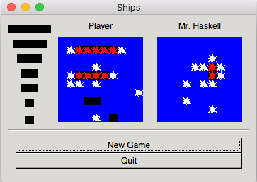

# Battleships game

Build in Haskell with some other folks in [Utrecht Summer School in Computing Science 2009](http://www.utrechtsummerschool.nl/). It was cool experience!

I found the game after several years and wanted it to bring the game to life with stack. It works but is buggy

Install gtk and stack first. On mac do

	brew install gtk
	brew install haskell-stack

Build it with

	stack build
